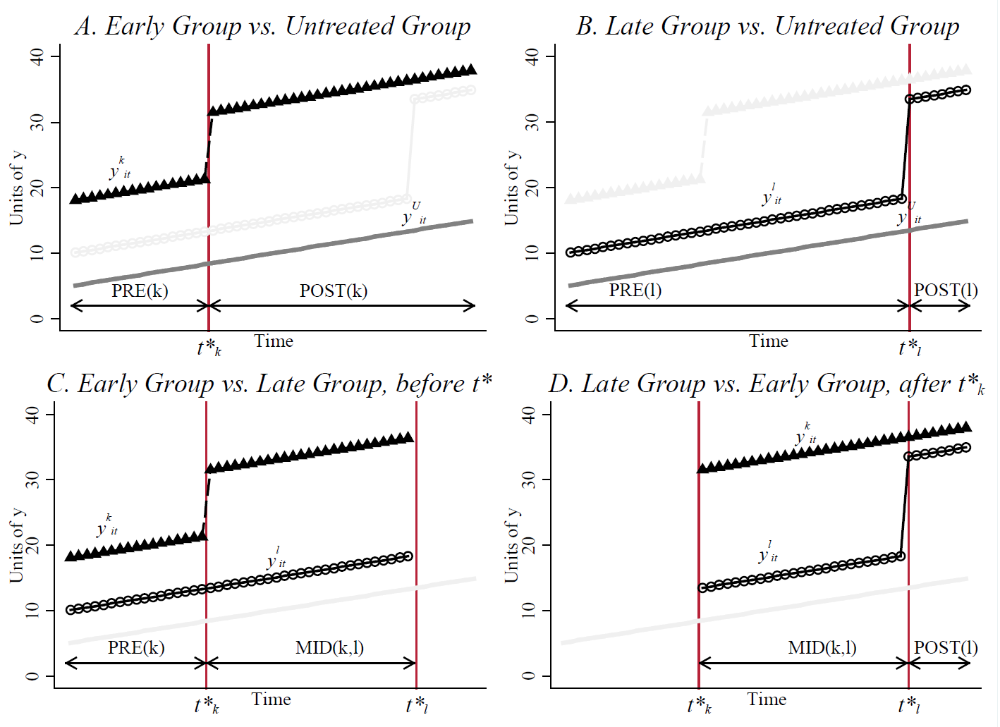

```{r setup, include = FALSE}
knitr::opts_chunk$set(echo = T,
                      eval = T,
                      include = T,
                      message = FALSE,
                      warning = FALSE,
                      results = "hide")
library(tidyverse)
```

# Contributions that identify problems

## Goodman-Bacon 2018 {#GoodmanBacon}
The paper proves that the DiD estimator in this situation is a weighted average of all possible two-group DD estimators in the data. This is called the Goodman-Bacon decomposition model.

Imagine 3 units:
1. Early treated
2. Late treated
3. Never treated

*The Goodman-Bacon decomposition model*: Decomposes two-way fixed effect model into two-group comparisons -- including comparing treated with previously treated as control group, e.g.:
Early treated - Never treated
Late treated  - Never treated
Early treated - Late treated, before the treatment of the Early treated occurs
Late treated  - Early treated, after the treatment of the Early treated occurs




From this, the paper covers a lot of the potential problems with the standard DiD-estimator and TWFE-models.


### The problems it identifies

#### Problem 1: Staggered adoption
Most DiD-applications have [**staggered adoption**](definitions.html). The DiD-estimator is the weighted average of all two-group comparisons. Units will be weighted by:

- Group size

-   Variance of treatment

-- Observations with below mean levels of residualized treatment intensity (after controlling for country FE) receive negative weight, and may be thought of as part of the comparison group. _Haakon: I can't really remember if referred to the DiD-estimator or if this referred to the TWFE?? I guess maybe both since DiD estimator is equivalent to the linear two-way fixed effects regression estimator if there are two time periods and the treatment is administered to some units only in the second time period._


#### Problem 2: Early treatment spills into DiD-estimate of late treatment

Many effects do not appear instantly, but could be slow moving. It is possible that units that receives the treatment late are compared to units that have received the treatment and where the full effect of the first treatment has not yet manifested.

The following figure illustrates a scenario where the late treated will be compared to the early treated while the early treated is still manifesting the effect of the treatment:

```{r slow_treatment}

slow <- data.frame(id = c(rep("Early treated", 6),
                          rep("Late treated", 6),
                          rep("Never treated", 6)),
                        time = rep(1:6, 3),
                        y = c(rep(2, 2), 3, 4, 5, 5,
                              rep(1, 3), 2, rep(3, 2),
                              rep(0, 6)),
                        Treated = c(rep("No", 2), rep("Yes", 4),
                                    rep("No", 3), rep("Yes", 3),
                                    rep("No", 6)
                        ) 
)

ggplot(slow, aes(x = time, y = y, group_by = id, color = id)) +
  geom_line() +
  scale_color_manual(values = c("red", "darkgreen", "blue")) +
  scale_fill_manual(values = c("white", "grey50")) +
  geom_label(aes(label = y, fill = Treated)) +
  scale_y_continuous(limits = c(-1, 5), breaks = c( 0:5 ) ) +
  theme_minimal()


```

### Implementing Goodman-Bacon-decomposition
The Goodman-Bacon decomposition allows you to inspect the existence of negative weights. The following code does this:

```{r decomp, message=FALSE, warning=FALSE}
library(bacondecomp) #Relies on fixest for the regression
source("Data/generate_panel_data.R") #Generate random data

df_bacon <- bacon(y ~ treat,
                  data = dat,
                  id_var = "id",
                  time_var = "time")

ggplot(df_bacon) +
  aes(x = weight, y = estimate, shape = factor(type)) +
  geom_point() +
  geom_hline(yintercept = 0) + 
  theme_minimal() +
  labs(x = "Weight", y = "Estimate", shape = "Type")

```

## Jakiela 2021 {#Jakiela}

### The problem it solves
How to diagnose problems in two-way fixed effects models.

TWFE gives biased estimates if treatment is applied at different times (staggered adoption). In practice, TWFE gives negative weights. Most likely to happen with early treated and more likely to happen in late period. Treated units with negative weights will effectively be control-observations for other treated units.

Having negative weights on treated observations is not necessarily bad. Less likely to be a problem if you have

1. Enough never-treated observations and 

2. Enough pre-treatment data

3. And the treatment effects are homogeneous across all countries. 


### The way it solves it
The paper gives a way to diagnose problems. Two questions must be answered:

1. Do I have negative weights?

2. Can we reject the hypothesis that the treatment effects are homogeneous?


Use treatment as the outcome and calculate residuals from that. `R` code in Goodman-Bacon.


Some solutions if you have the problem:

1. Exclude later years
2. Limit how many post-treatment years are kept
3. Exclude individual countries

### Summary of Jakiela 2021 from Andrew Heiss

Andre Heiss' blog: https://www.andrewheiss.com/blog/2021/08/25/twfe-diagnostics/#residualized-weights-with-twfe-models

- We can think of OLS as a weighted sum of outcome values - these weights are typically negative for untreated observations and positive for treated observations 

- In TWFE situations, these weights take country and year into account because of mathy reasons, treated observations can actually get negative weights -- especially countries that are early adopters, and country-year observations in later years.

- We can see if these negative weights on treated observations are an issue by using a couple simple diagnostics: see how many and which treated observations have negative weights, and see if the treatment effect is homogeneous across treated countries 

- We can look at which treated observations have negative weights by making some plots and exploring the data 

- We can check for the homogeneity of the treatment effect by running a regression that uses the residualized treatment and treatment status to explain the residualized outcome. 

- If the slopes for treated and comparison observations are indistinguishable, we can safely assume treatment homogeneity. 

- Finally, we can check how robust the TWFE estimate is to negative treatment weights and the assumption of homogeneity by dropping specific types of observations and checking the ATE across these modified datasets

