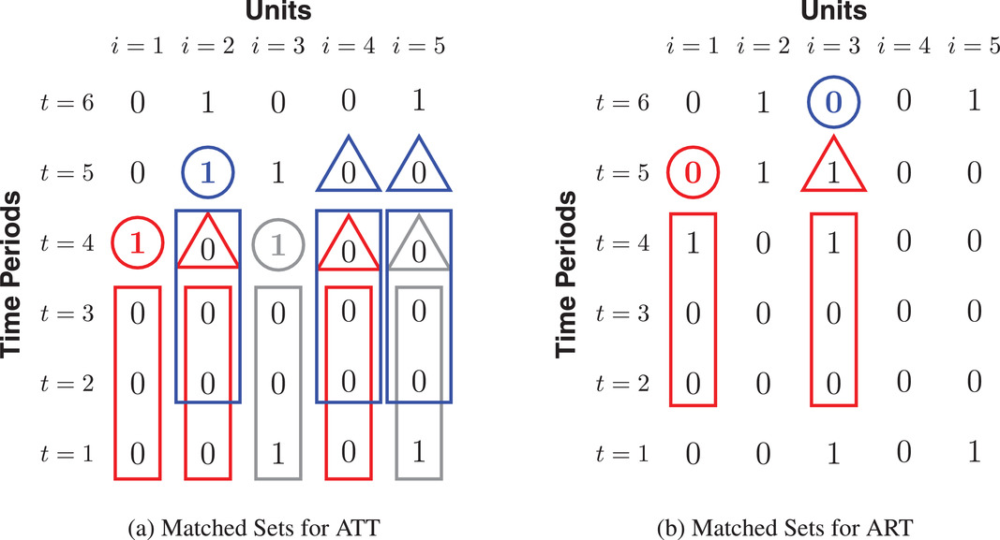

```{r setup, include = FALSE}
knitr::opts_chunk$set(echo = T,
                      eval = T,
                      include = T,
                      message = FALSE,
                      warning = FALSE,
                      results = "hide")

```


# Contributions that offer solutions

## Imai, Kim and Wang 2022 {#ImaiKimWang}

["Matching methods for Causal Inference with Time-Series Cross-Sectional Data" by Imai, K., Kim, I.S. and Wang, E.H. (2022)](https://doi.org/10.1111/ajps.12685)

R-package: [PanelMatch()](https://github.com/insongkim/PanelMatch).

$~$

### The problem it solves

Most matching methods are not fit for Time-Series Cross-Sectional (TSCS) data. The few solutions that exist assume [**staggered adoption**](definitions.html). They create a matched DiD-application for TSCS-data without this assumption.

They address staggered adoption both in the sense that units are treated at unequal T, but also that there is a Average Causal effect of Reversal (ART), so that units jump back and forth in being treated.

$~$

### The way it solves it

Their proposed solution is best understood as a three-stage process. In stage 1 we construct, for each treated unit, a matched set of control units that share identical treatment status over an adjustable time period [**L**](definitions.html). In stage 2 we refine these matched sets of units by balancing over observed, time-varying confounders. In stage 3 we execute the DiD-estimator.

```{r preperation, eval = TRUE}

library(tidyverse);library(PanelMatch);library(did)
data(dem) # Example data from "Democracy Does Cause Growth" by Acemoglu, Naidu, Restrepo, and Robinson (2019)

```

$~$

#### Stage 1: Constructing matched sets

In the first stage, units that experience the treatment are matched with units that do not experience the treatment (control). This is practically an exact-match procedure, but relying only on the units' treatment status over a user-specified length of time. This length of time is called [**L**](definitions.html) (short for Lags). If L = 0, units are matched solely on treatment status at time T, but this this would no longer be utilizing the time-dimension in the dataset.

In figure \@ref(fig:ExampleStage1) they illustrate an example with 5 units over 6 time periods, with L = 3. Values in the triangles and circles indicate whether this is a treated unit or a control unit, while the square box is the pre-treatment period, the length of which is defined by [**L**](definitions.html). In creating matched sets, units with similar pre-treatment periods *across the exact same time periods T* but with unequal treatment status in the triangles/circles are matched together to compose a set. In the left-hand panel (a), we are looking for units we can use to find the [**ATT**](definitions.html). The three red units and the three blue units compose separate matched sets with one treated unit and two control units. The grey units compose a third matched set with one treated unit and one control unit.

The right-hand panel (b) is similar, but now we are looking for sets with which we can analyse the [**ART**](definitions.html). The blue circle in this panel simply illustrates a case of reversal but which do not have any suitable match in the data.

Any data point that does not enter into a matched set is discarded.

$~$



$~$

The following R-code gives an overview of the `PanelMatch()`-arguments that refer to stage 1:

```{r Stage1_Arguments, eval = FALSE}


mod <- PanelMatch(
  
  #General information for the PanelMatch-function:
  data = dem, #Data to be used
  time.id = "year", #Name of time-column 
  unit.id = "wbcode2", #Name of unit-column
  treatment = "dem", #Name of treatment variable
  outcome.var = "y", #Name of outcome variable (they have named the column Y...lol...)
  qoi = "att", #Quantity of interest.
  verbose = TRUE, #Prints more information about all calculations
  
  #    Arguments for Stage 1:
  matching = TRUE, #Should Stage 1 exact match on treatment history?
  lag = 4, # This argument controls the number of lags, notated as "L" int he article
  match.missing = FALSE, # Should patterns of missingness be included in matching the units into sets?
  listwise.delete = TRUE, #Delete missingness listwise
  exact.match.variables = NULL, #In principle, the exact matching in stage 1 can include all categorical variables, not just the treatment history. Character vector of relevant categorical variables can be added here. NULL means that we will only match on treatment history.
  
  ...
  
)

```

$~$

#### Stage 2: Refine match sets

In stage 2 the goal is to establish balance on time-varying covariates within these matched sets over the pre-treatment period ([**L**](definitions.html)). This is to address the [**parallel trends assumption**](definitions.html). This can be done with many existing approaches, and the article suggests either using a matching procedure such as Mahalanobis distance or Propensity matching, or create unit weights.

In the evaluations in the article, weighting performs better, and at times a lot better, than distance matching.

##### Distance-balancing

*Using Mahalanobis-distance:* Computes standardized Mahalanobis-distance between the treated unit and each of its matched control units, averaged over the pre-treatment period.

*Propensity score matching:* Estimates the conditional probability that a unit will experience the treatment given pre-treatmeant covariates (the propensity score). This approach requires additional specification for how to estimate the probability of being treated, such as a logistic regression.

Once a distance measure has been selected and computed, the sample is reduced to the **J** most similar units within each matched set.

##### Weight-balancing

Each control unit within each matched set is assigned a weight, with greater weight assigned to more similar units. This approach requires the user to select some method to determine similarity. The authors suggest [propensity score weighting](https://onlinelibrary.wiley.com/doi/10.1111/1468-0262.00442) or calibration weights.

$~$

The following R-code gives an overview of the `PanelMatch()`-arguments that refer to stage 2:

```{r Stage2_Arguments, eval = FALSE}


mod <- PanelMatch(
  
  #General information for the PanelMatch-function:
  data = dem, #Data to be used
  time.id = "year", #Name of time-column 
  unit.id = "wbcode2", #Name of unit-column
  treatment = "dem", #Name of treatment variable
  outcome.var = "y", #Name of outcome variable (they have named the column Y...lol...)
  qoi = "att", #Quantity of interest.
  verbose = TRUE, #Prints more information about all calculations
  
  #    Arguments for Stage 1:
  ...
  
  #    Arguments referring to Stage 2:
  lead = 0:4, #How far (years) into the future should the outcome be measured? Notated as F in the article
  forbid.treatment.reversal = FALSE, #Should reversal be allowed in the period between the treatment occurs (T) and the outcome is measured (T + leads/F)
  refinement.method = "CBPS.weight", #Covariate balancing propensity score weights from Imai and Ratkovic (2014)
  size.match = 5, #Indicates the J closest matches to keep in the refinement. This is only relevant for the distance-methods, not weight-methods.
  covs.formula = as.formula(~ I(lag(tradewb, 1:4)) + I(lag(y, 1:4)) #Formula for refinement
                            
  )
  
```

$~$

#### Stage 3: The DiD-estimator

Before executing the DiD-estimator, the user needs to specify how long into the future the effect should occur, called [**F**](definitions.html). If F = 2 and treatment occurs in T = 0, then the outcome Y from T+2 is used. This is similar to lagging the treatment variable in a normal regression setup, but with a lead-logic instead. Once F is specified, we can proceed with the DiD-estimator.

The DiD-estimator sequence: 1. Calculates the counterfactual outcome for each treated unit using the weighted average of the refined matched control units. 2. Computes DiD estimate of the ATT for each treated unit. 3. Averages the ATT estimates across all treated units.

$~$

The following R-code first runs stage 1 and 2 with the `PanelMatch()`-function, then executes stage 3 using the `PanelEstimate`-function. It also produces a simply visualization of the result:

$~$

```{r FullFunction, eval = TRUE}
      
      
      mod <- PanelMatch(
        
        #General information for the PanelMatch-function:
        data = dem, #Data to be used
        time.id = "year", #Name of time-column 
        unit.id = "wbcode2", #Name of unit-column
        treatment = "dem", #Name of treatment variable
        outcome.var = "y", #Name of outcome variable (they have named the column Y...lol...)
        qoi = "att", #Quantity of interest.
        verbose = TRUE, #Prints more information about all calculations
        
        #    Arguments for Stage 1:
        matching = TRUE, #Should Stage 1 exact match on treatment history?
        lag = 4, # This argument controls the number of lags, notated as "L" int he article
        match.missing = FALSE, # Should patterns of missingness be included in matching the units into sets?
        listwise.delete = TRUE, #Delete missingness listwise
        exact.match.variables = NULL, #In principle, the exact matching in stage 1 can include all categorical variables, not just the treatment history. Character vector of relevant categorical variables can be added here. NULL means that we will only match on treatment history.
        
        #    Arguments referring to Stage 2:
        lead = 0:4, #How far (years) into the future should the outcome be measured? Notated as F in the article
        forbid.treatment.reversal = FALSE, #Should reversal be allowed in the period between the treatment occurs (T) and the outcome is measured (T + leads/F)
        refinement.method = "CBPS.weight", #Covariate balancing propensity score weights from Imai and Ratkovic (2014)
        size.match = 5, #Indicates the J closest matches to keep in the refinement. This is only relevant for the distance-methods, not weight-methods.
        covs.formula = as.formula(~ I(lag(tradewb, 1:4)) + I(lag(y, 1:4)) ) #Formula for refinement
        
      )
      
      #Stage 3
      res <- PanelEstimate(sets = mod, data = dem)
      
      #Simple visualization of the result
      plot(res)
      
      
```
$~$

### Unsolved problems

-   Requires binary treatment

$~$

### List of assumptions

-   Parallel trends

-   Assumed causal order: Confounders Z are realized before treatment X is realized before outcome Y

-   Assumes absence of between-unit spillover effects (they are looking into applications without this assumption)


## Callaway and Sant'Anna 2021

["Difference-in-Differences with Multiple Time Periods" by Callaway, Brantly and Sant'Anna, Pedro H. C. (2021)](https://www.sciencedirect.com/science/article/abs/pii/S0304407620303948)

R-package: [did](https://cran.r-project.org/web/packages/did/vignettes/did-basics.html)

### The problem it solves

Heterogeneous treatment effects: What is compared to what?

They argue that there is no problem with staggered adoption if effect is homogeneous. Problem is homogeneous effects

### The way it solves it
Estimate the effect at various time periods. Then the first treatment effects is updated by later treatment effects.

This code implements the method:

```{r, message=FALSE, warning=FALSE, fig.height=12}
    source("Data/generate_panel_data.R") #Generate random data

    out <- att_gt(yname = "y",
    gname = "first_treat",
    idname = "id",
    tname = "time",
    xformla = ~1,
    data = dat,
    est_method = "reg",
    control_group = "notyettreated" #Will include units that will receive treatment later as control group
    )
    
    #Plot
    ggdid(out, ylim = c(-.25,.1))
    
    #Event-type plot
    es <- aggte(out, type = "dynamic")
    ggdid(es)
    
```

Event-type plot:

```{r, message=FALSE, warning=FALSE, height=12}
    #Event-type plot
    es <- aggte(out, type = "dynamic")
    ggdid(es)
    
```


### Things we didn't understand

Many, us included, struggle to understand what the solution actually does. In many ways, many papers just do what Wooldridge suggests: Allow more flexibility.

<!-- ## Gardner 2021 -->

<!-- ["Two-stage differences in differences" by Gardner, John (2022)](https://jrgcmu.github.io/2sdd2.pdf) -->

<!-- R-package: [did2s](https://asjadnaqvi.github.io/DiD/docs/code_r/07_did2s_r/) -->

<!-- ## Sun and Abrahams 2021 -->

<!--     ["Estimating Dynamic Treatment Effects in Event Studies with Heterogeneous Treatment Effects" by Sun, Liyang and  Abraham, Sarah (2021)](https://www.sciencedirect.com/science/article/abs/pii/S030440762030378X) -->

<!-- R-package: [sunab()-function](https://lrberge.github.io/fixest/reference/sunab.html) in [fixest](https://lrberge.github.io/fixest/index.html) -->

## Wooldridge 2021 {#wooldridge}

["Two-Way Fixed Effects, the Two-Way Mundlak Regression, and Difference-in-Differences Estimators" by Wooldridge, Jeffrey M. (2021)](https://www.researchgate.net/publication/353938385_Two-Way_Fixed_Effects_the_Two-Way_Mundlak_Regression_and_Difference-in-Differences_Estimators)

Wooldridge's [Dropbox folder](https://t.co/q1AnkhEF97) (Contains Stata-code)

[The Tweet](https://twitter.com/jmwooldridge/status/1427472491367305219?s=20&t=t0PDmFzAL9-lokGyUo0r7A)


### The problem it solves
Lots of fancy new stuff, but you can also just use regression.


### The way it solves it
Instead of having dummies for each group, you can just control for the average. And then adding interaction terms to these solves all of the various problems.

